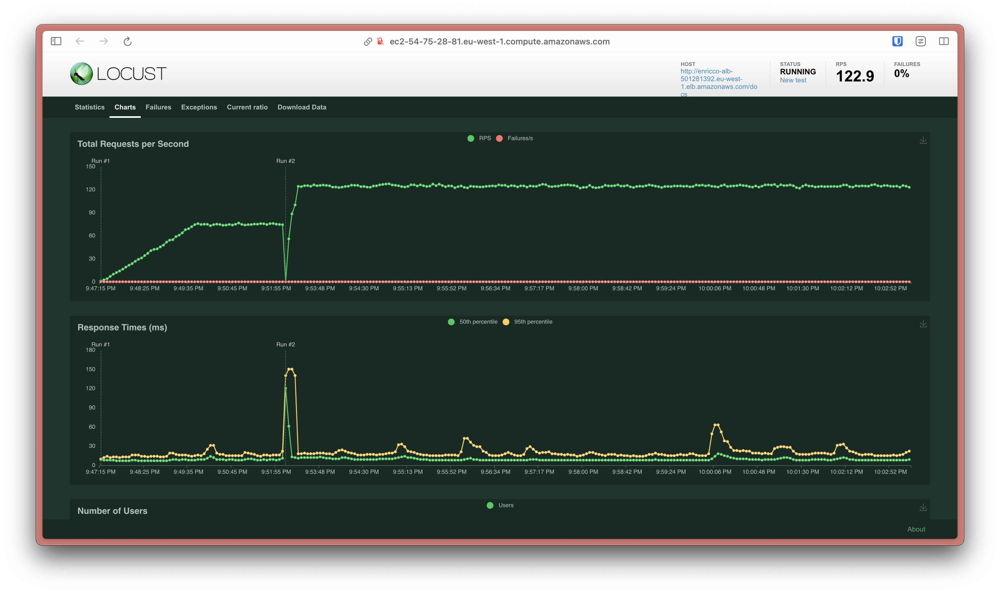
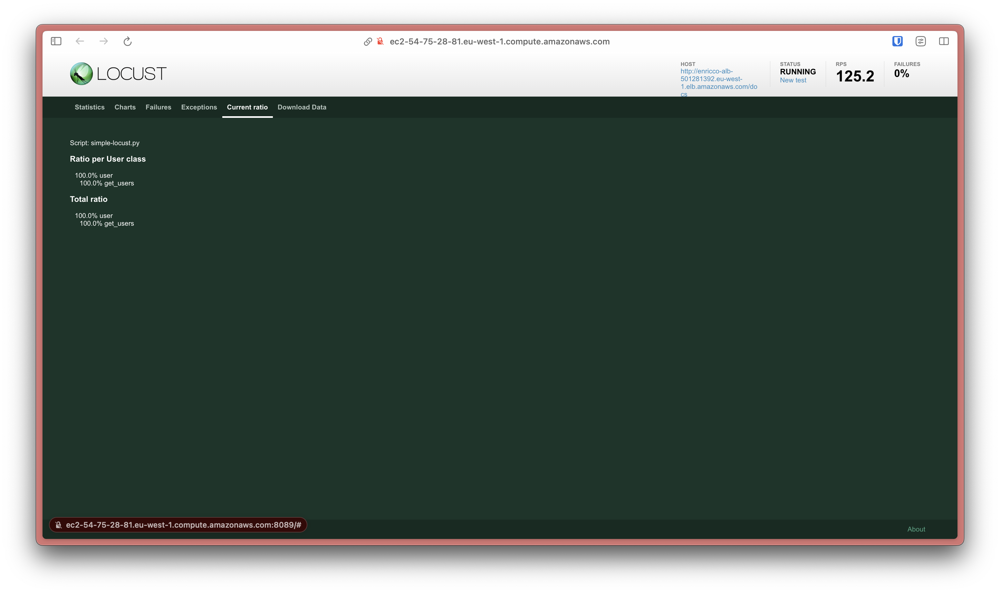
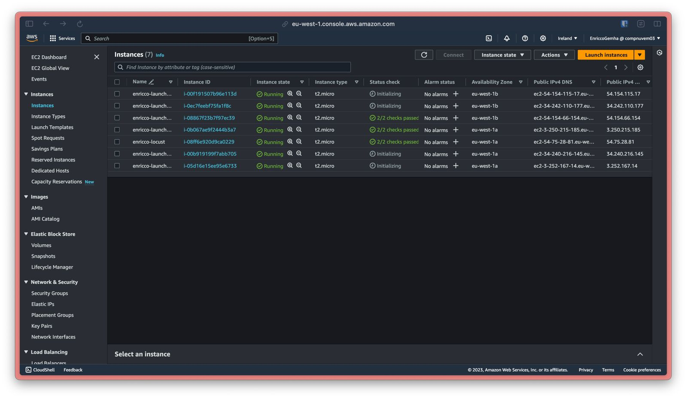
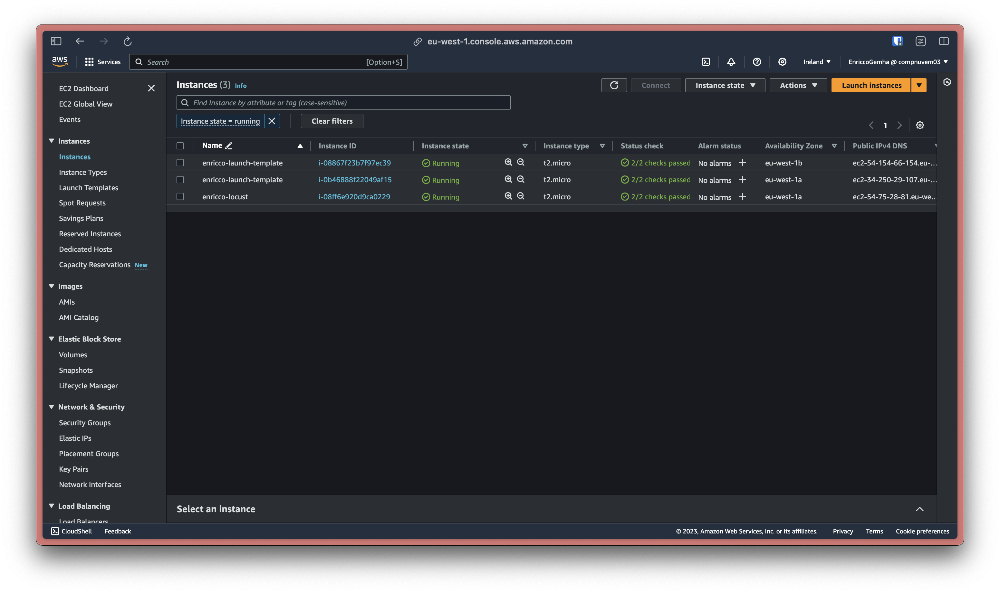
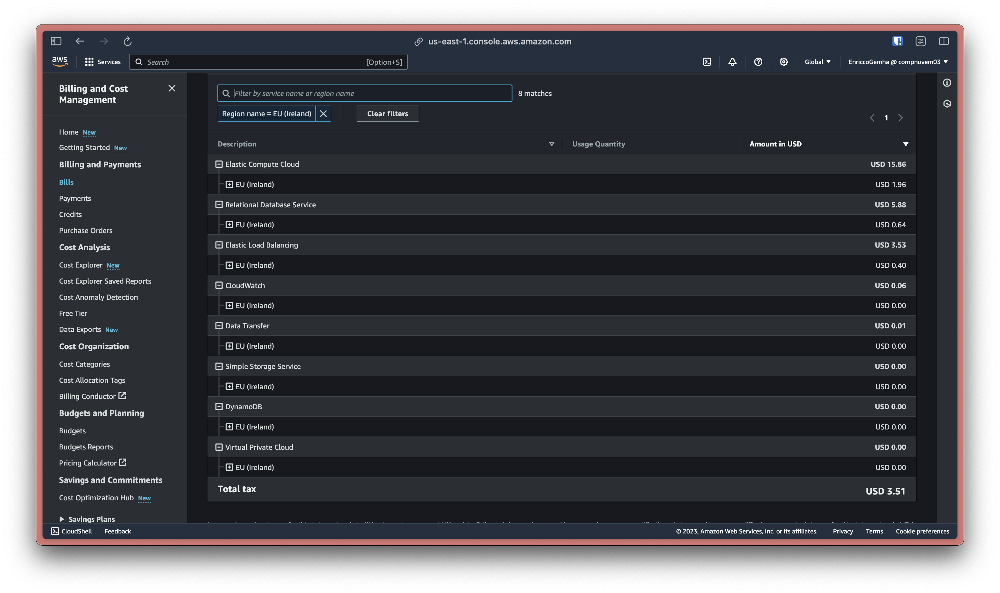
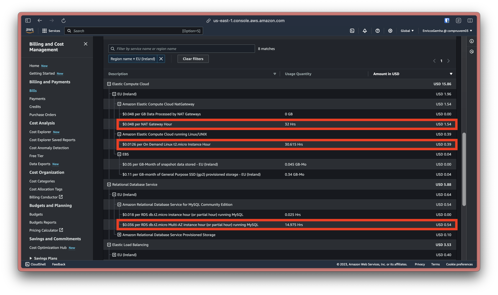

# Infraestrutura AWS usando Terraform para Aplicação CRUD em FastAPI

🇺🇸 Versão em Inglês: [clique aqui](./README.md)

## Introdução

Projeto desenvolvido por **Enricco Gemha** para a disciplina de **Computação em Nuvem** do curso de **Engenharia de Computação** do **Insper Instituto de Ensino e Pesquisa**.

Dado a especificação do projeto, foi desenvolvido um CRUD simples em Python utilizando os frameworks FastAPI e SQLAlchemy, e o banco de dados MySQL, disponível em [Python-FastAPI-CRUD](https://github.com/G3mha/Python-FastAPI-CRUD).

A aplicação foi hospedada na Amazon Web Services (AWS), sendo possível criar toda a infraestrutura necessária para a aplicação utilizando somente o script Terraform disponível neste repositório, bem como destruí-la completamente.

## Subindo a infraestrutura com Terraform

Para começar, é necessário ter uma conta na AWS e obter seu `access_key_id` e `secret_access_key`.

O próximo passo é instalar o AWS CLI, e configurar as credenciais de acesso no seu computador, para isso siga as instruções disponíveis [aqui](https://docs.aws.amazon.com/pt_br/rekognition/latest/dg/setup-awscli-sdk.html).

Em seguida, é necessário instalar o Terraform, para isso siga as instruções disponíveis [aqui](https://developer.hashicorp.com/terraform/install).

E configure o arquivo `terraform.tfvars` no `<path_to_this_project>/terraform` com as informações necessárias para a criação da infraestrutura. O arquivo deve ter o seguinte formato:

```terraform
db_username = "<usuário>"
db_password = "<senha>"
```

**Assumindo que você esteja na raíz do repositório**, execute os seguintes comandos:

```bash
cd terraform/bucket
terraform init
terraform validate
terraform plan -out="tfplan"
terraform apply "tfplan"
```

```bash
cd ..
terraform init
terraform validate
terraform plan -out="tfplan"
terraform apply "tfplan"
```

## Testando a aplicação

Ao final da execução do Terraform, serão exibidos no terminal, respectivamente, o ALB DNS name e o Locust Public IPv4 DNS.

Para testar a aplicação FastAPI, é necessário acessar o endereço da ALB no navegador. Para testar a aplicação Locust, é necessário acessar o endereço do Locust no navegador.

## Destruindo a infraestrutura com Terraform

Para destruir a infraestrutura, execute os seguintes comandos:

```bash
cd terraform/bucket
aws s3 rm s3://enricco-terraform-state --recursive
terraform destroy
```

```bash
cd ..
terraform destroy
```

## Diagrama de infraestrutura


Neste diagrama, cada cor representa uma camada de abstração da infraestrutura, sendo `preto` a cor referente a camada de serviços AWS, ou seja, a camada de "cloud", em `roxo` a camada de rede, como o IPRouter e a VPC, em `vermelho` as camadas de segurança, representadas pelos Security Groups, em `verde` as camadas de subnets, pública e privada, em `azul` a camada de monitoramento, representada pelo CloudWatch, e em `laranja` a camada de aplicação, representada pelas instâncias EC2, o ALB e o banco de dados RDS, bem como a própria aplicação CRUD que é visível ao usuário. A World Wide Web é representada por um círculo em `azul`. As setas representam a comunicação entre os serviços.

## Documentação da aplicação

Serviços utilizados:

### VPC (Virtual Private Cloud)

A Virtual Private Cloud (VPC) foi criada para isolar a infraestrutura. A VPC possui CIDR 172.31.0.0/16. Assim, geramos 2 subnets privadas e 2 subnets públicas, sendo:

- Subnet privada 1:
  - CIDR: 172.31.0.0/26
  - Availability Zone: `eu-west-1a`;

- Subnet privada 2:
  - CIDR: 172.31.0.64/26
  - Availability Zone: `eu-west-1b`;

- Subnet pública 1:
  - CIDR: 172.31.0.128/26
  - Availability Zone: `eu-west-1a`;

- Subnet pública 2:
  - CIDR: 172.31.0.192/26
  - Availability Zone: `eu-west-1b`;

### Security Groups

Para garantir a segurança da aplicação, foram criados quatro Security Groups, permitindo somente os serviços necessários para o funcionamento da aplicação. São eles:

- ALB Security Group:
  - Entrada: permite tráfego HTTP (80) e SSH (22) de qualquer origem;
  - Saída: permite tráfego de qualquer protocolo para qualquer destino;

- EC2 Security Group:
  - Entrada: permite tráfego HTTP (80) proveniente do ALB Security Group e SSH (22) de qualquer origem;
  - Saída: permite tráfego de qualquer protocolo para qualquer destino;

- RDS Security Group:
  - Entrada: permite tráfego MySQL (3306) proveniente do EC2 Security Group;
  - Saída: permite tráfego de qualquer protocolo para qualquer destino;

- Locust Security Group:
  - Entrada: permite tráfego de qualquer protocolo para qualquer origem;
  - Saída: permite tráfego de qualquer protocolo para qualquer destino;

### IAM

Para garantir que as permissões adequadas fossem assinaladas para as instâncias EC2, foi criado um IAM Role, com permissões de escrita de logs, principalmente.

### RDS (Relational Database Service)

O RDS foi criado para hospedar o banco de dados MySQL. Portanto, sua engine é `mysql` na versão `8.0.33`, com `Multi-AZ` habilitado. Os backups são retidos por 7 dias, e com uma janela de manutenção semanal, às segundas-feiras, das 03:00 às 04:00, e de backup diário, das 04:00 às 05:00. O RDS possui uma instância `db.t2.micro` com 20GB de armazenamento `gp2`. Para garantir a segurança do acesso ao banco de dados, os dados de usuário e senha são configurados em um arquivo `terraform.tfvars` e estão disponíveis somente neles.

### ALB (Application Load Balancer)

O ALB foi criado para balancear a carga entre as instâncias EC2. Ele está disponível publicamente na Internet. Ele tem um listener na porta 80 que encaminha o tráfego para o Target Group configurado (Instâncias EC2).

### ASG (Auto Scaling Group)

Mantém a quantidade de instâncias EC2 em 2, com um mínimo de 2 e um máximo de 6. A política de escalonamento é configurada para expandir a quantidade de instâncias quando a utilização de CPU atingir 70%, e reduzir a quantidade de instâncias quando a utilização de CPU atingir 20%. A política de Health Check é configurada para verificar a saúde das instâncias a cada 5 minutos, com um tempo de espera de 1 minuto, e um limite de 1 falha consecutiva.

## Decisões técnicas

- Para a aplicação, configurada em Ubuntu, foi utilizado Elastic Compute Cloud (EC2);
- Para banco de dados, foi hospedado no Relational Database Service (RDS);
- Para a comunicação entre os serviços, foi utilizado o serviço de Virtual Private Cloud (VPC);
- Para monitoramento de utilização, foram implementadas métricas e políticas utilizando o serviço de CloudWatch;
- Para balanceamento de carga, foi utilizado o serviço de Application Load Balancer (ALB);
- Para garantir a proteção da comunicação entre os serviços, foram criados _firewalls_, utilizando o serviço de Security Groups;
- Para garantir o redirecionamento para somente instância saudáveis, foram implementados Health Checks para o ALB;
- Para garantir a alta disponibilidade, foram criadas duas instâncias EC2 padrão, escaláveis até seis, através de uma Auto Scaling Group (ASG);
- Para garantir que não haja concorrência nas operações do Terraform, foi utilizado o serviço de Locking do DynamoDB, com armazenamento de estado no S3, garantindo o versionamento do código;
- Para garantir a segurança das instâncias, foi criado um IAM Role, com somente as permissões necessárias para a execução do script de instalação e configuração da aplicação.

### A escolha de região

Com regiões de disponilibidade em todo o mundo, vem também a necessidade de escolher uma região com requisitos que favoreça o desempenho e custo da aplicação. Esses benefícios são obtidos através de requisitos de:

- **Velocidade de Conexão** (Latência):
  - Por ser uma aplicação web que não será consumida como produto final, a latência é um fator opcional, pois não é um fator que influencia diretamente na experiência do usuário. Por isso **não foi um fator decisivo na escolha** da região;

- **Velocidade de Processamento**:
  - Devido aos dados a serem processados serem pequenos e simples, a velocidade de processamento não impacta de forma relevante na aplicação, portanto **não foi um fator decisivo na escolha** da região;

- Disponibilidade de Serviços:
  - A AWS possui uma grande variedade de serviços, e a maioria deles está disponível em todas as regiões, contudo existem restrições. Por exemplo, o `t2.micro`, escolhida por ser a opção _low-cost_ e _general purpose_ da AWS, está [disponível somente em](https://aws.amazon.com/pt/about-aws/whats-new/2014/07/01/introducing-t2-the-new-low-cost-general-purpose-instance-type-for-amazon-ec2/):
    - `us-east-1` (N. Virginia);
    - `us-west-2` (Oregon);
    - `eu-west-1` (Ireland);
    - `ap-northeast-1` (Tokyo);
    - `ap-southeast-1` (Singapore);
    - `ap-southeast-2` (Sydney);
    - `sa-east-1` (São Paulo);
  - Há também a necessidade de se descartar as regiões com outages mais frequentes, e como podemos ver nesta [_thread_ da YCombinator](https://news.ycombinator.com/item?id=13756082) (Aceleradora de Startups de Silicon Valley), a região `us-east-1` (N. Virginia) é explicitamente não recomendada, pois possui um histórico de outages mais frequentes, bem como equipamento ultrapassado. Ainda no mesmo tópico, o site [AWSManiac](https://awsmaniac.com/aws-outages/) menciona as seguintes regiões como as de maior quantidade de outages da história da AWS, nesta ordem:
    - `us-east-1` (N. Virginia);
    - `ap-southeast-2` (Sydney);
    - `ap-northest-1` (Tokyo);
  - O site [StatusGator](https://statusgator.com/blog/is-north-virginia-aws-region-the-least-reliable-and-why/) oferece uma lista com as regiões com maior tempo de downtimes parcias em 2022, sendo, nesta ordem, as três piores:
    - `us-east-1` (N. Virginia);
    - `us-west-2` (Oregon);
    - `us-east-2` (Ohio);

- Custo de Serviços:
  - O custo de serviços é um fator importante em qualquer aplicação, e como o objetivo deste projeto é criar uma aplicação de baixo custo, é necessário escolher uma região que ofereça os serviços necessários com o menor custo possível. Os dados são o site [ConcurrencyLabs](https://www.concurrencylabs.com/blog/choose-your-aws-region-wisely/), com dados extraídos da AWS PriceList API. Portanto, da lista da `t2.micro` acima, podemos observar os seguintes preços (porcentagem de diferença em relação a `us-east-1`, a mais barata):
    - [0%] `us-east-1` (N. Virginia);
    - [0%] `us-west-2` (Oregon);
    - [11%] `eu-west-1` (Ireland);
    - [22%] `ap-northeast-1` (Tokyo);
    - [14%] `ap-southeast-1` (Singapore);
    - [26%] `ap-southeast-2` (Sydney);
    - [52%] `sa-east-1` (São Paulo);

Baseado nesses requisitos, excluímos todas as regiões que não possuem `t2.micro`. Em seguida, excluímos a região `us-east-1` (N. Virginia) pela imensa quantidade de outages. Excluímos `ap-southeast-2` (Sydney), `ap-northeast-1` (Tokyo) e `sa-east-1` (São Paulo) por possuírem uma grande diferença de custo em relação a `us-east-1` (N. Virginia). E por fim, excluímos `us-west-2` (Oregon) por possuir um histórico de outages, apesar de ser a segunda região mais barata. Com isso, ficamos em um empate entre `eu-west-1` (Ireland) e `ap-southeast-1` (Singapore), e como a região `eu-west-1` (Ireland) possui um custo 11% menor, foi a escolhida para hospedar a aplicação.

### A escolha de monitoramento

O projeto utiliza o CloudWatch para monitorar as instâncias EC2 e o RDS. Métricas essenciais, como Utilização de CPU e Contagem de Requisições da ALB, são monitoradas. Para a utilização de CPU, políticas de escalonamento são definidas em 70% para acionar a expansão e 20% para a redução, garantindo eficiência financeira de recursos. Da mesma forma, a métrica de Contagem de Requisições da ALB é configurada com limites 150 requisições, em um intervalo de espera de 5 minutos para evitar uma redução rápida de escala.

### A escolha de instâncias

O projeto utiliza a `t2.micro` para implantação de instâncias EC2. Por ser uma aplicação CRUD, essa configuração de baixo custo provisiona recursos suficientes para lidar com essas operações básicas. Isso contribui para maximizar a eficiência financeira do projeto.

### A escolha do banco de dados

O projeto utiliza a `db.t2.micro` para o RDS, que é ótima para operações CRUD. Optamos pela implantação em Multi-Availability Zone para garantir alta disponibilidade, bem como tolerância a falhas. Por fim, optamos pelo General Purpose SSD (GP2) com capacidade de 20GB que dá uma ótima margem para necessidades de armazenamento do projeto, que cobre uma possível escalada de requisitos do projeto.

## Estimativa de custo de manutenção mensal

Para realizar uma estimativa de custos, foi utilizado o [AWS Pricing Calculator](https://calculator.aws/#/). Os custos foram estimados para um período de 1 mês, e os valores foram convertidos para Reais utilizando a cotação do dólar do dia 03/12/2023, de R$4,92, de acordo com o [Banco Central do Brasil](https://www.bcb.gov.br/conversao).

O valor total estimado para o período de 1 mês foi de **$73.71**, ou seja, **R$362,65**. O resultado da calculadora de custo já com os valores de cada serviço configurado está disponível publicamente [neste link](https://calculator.aws/#/estimate?id=38b2eace6007c3130f5064e74299cf6d9eea6c94), ou no PDF dentro do repositório, no caminho `/docs/AWS Pricing Calculator`. Abaixo, temos um resumo da configuração utilizada para a estimativa de custos:

### Amazon Virtual Private Cloud (VPC)

Parâmetros:

- Região: `eu-west-1` (Ireland);
- VPC services: `Data Transfer`;
- Number of VPN Connections: `1`;
- Data Transfer Intra-region (GB): `1`;
- Data Transfer All other regions (GB): `1`.
- Data Transfer Out to Internet (GB): `1`;

### Amazon RDS for MySQL

Parâmetros:

- Região: `eu-west-1` (Ireland);
- Quantidade de instâncias: `1`;
- Tipo de instância: `db.t2.micro`;
- Utilização: `On-Demand (100%)`;
- Deployment options: `Multi-AZ`;
- Storage: `General Purpose SSD (gp2)`;
- Storage (GB): `20`.

### Amazon EC2

Parâmetros:

- Região: `eu-west-1` (Ireland);
- Tipo de instância: `t2.micro`;
- Tenancy: `Shared`;
- Operating System: `Linux`;
- Workloads: `Daily spike traffic`;
- Workload (days): `Monday to Friday`;
- Baseline (instances): `2`;
- Peak (instances): `6`;
- Duration of peak (hours): `6`;
- Payment option: `EC2 Instance Savings Plans (1 Year, No Upfront)`.

### Elastic Load Balancing

Parâmetros:

- Região: `eu-west-1` (Ireland);
- Tipo de load balancer: `Application Load Balancer`;
- Features: `Load Balancer on Outposts`;
- Número de ALBs: `1`.

### Amazon Simple Storage Service (S3)

Parâmetros:

- Região: `eu-west-1` (Ireland);
- S3 Storage Class: `Standard`;
- Storage (GB): `0.01`;
- Requests: `10`;
- Data Returned by S3 Select (GB): `0.001`.
- Data Scanned by S3 Select (GB): `0.01`.

### Amazon DynamoDB

Parâmetros:

- Região: `eu-west-1` (Ireland);
- Features: `DynamoDB Data Import from Amazon S3 feature`;
- Source file size (GB): `0.01`;

### Amazon API Gateway

Parâmetros:

- Região: `eu-west-1` (Ireland);
- API Type: `REST API`;
- Request units: `millions`;
- Requests per month: `1`;

### Amazon CloudWatch

Parâmetros:

- Região: `eu-west-1` (Ireland);
- Number of metrics: `2`;
- Number of Standard Resolution Alarm Metrics: `2`;

## Custo real utilizando o Locust para testes de carga

Para realizar os testes de carga, foi utilizado o Locust, uma ferramenta de código aberto para testes de carga. Sua utilização foi tão somente acessar o endereço no navegador e configurar um teste de carga de 250 usuários, com 50 usuários por segundo, e um tempo de execução de 10 minutos. O resultado do teste pode ser visto nas imagens abaixo:





Isso resulta na execução da Policy estabelecida para o ALB, que pode ser vista no dashboard depois de pouco tempo de execução do teste:



Depois do fim do teste carga, podemos ver que foi bem sucedido o downscaling das instâncias EC2:



Para calcular o custo real de manutenção mensal, foi utilizado o [AWS Billing and Cost Management](https://console.aws.amazon.com/billing/home?#/).

Como forma de validar a estimativa da Calculadora de Custos AWS, levamos em conta o tempo em que o teste carga rodou (10 minutos), com uma taxa de swarm do Locust de aproximadamente 122 RPS. Assim, observamos o painel de custos da região `eu-west-1` (Ireland), que pode ser visto abaixo:



Contudo é necessário deduzir os custos não relacionados ao swarm do Locust, neste caso os valores contornados em vermelho na imagem abaixo:



Portanto, do total de **$3.51**, devem ser descontados:

- 10 minutos representam aproximadamente 1.11% de 15 horas, portanto 11% sobre $0.54, resulta em desconto de **$0,48**;
- 10 minutos representam aproximadamente 0.52% de 32 horas, portanto 0.52% sobre $1.54, resulta em desconto de **$1.53**;
- 10 minutos representam aproximadamente 0.56% de 30 horas, portanto 0.56% sobre $0.39, resulta em desconto de **$0.389**.

Assim, o custo real de manutenção em 10 minutos de teste de carga é de **$1.111**. Vale ressaltar que esse é um fluxo muito atípico e que representa o equivalente ao fluxo de 1 dia da aplicação no mundo real. Assim, podemos extrapolar isso para a aplicação rodando todos os dias da semana, o custo real de manutenção mensal é de **$33,33**, ou seja, **R$163,99**.
