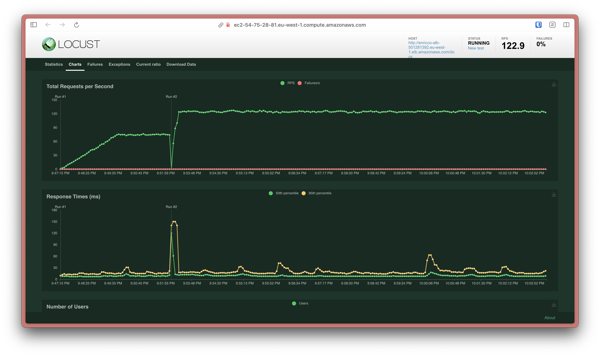

# AWS Infrastructure using Terraform for a FastAPI CRUD Application

🇧🇷 Version in Portuguese: [click here](./README-pt_BR.md)

## Introduction

Project developed by **Enricco Gemha** for the **Cloud Computing** course in the **Computer Engineering** program at **Insper**.

Following the project specifications, a simple CRUD was developed in Python using FastAPI and SQLAlchemy frameworks, along with a MySQL database, available at [Python-FastAPI-CRUD](https://github.com/G3mha/Python-FastAPI-CRUD).

The application was hosted on Amazon Web Services (AWS), with all necessary infrastructure being created using only the Terraform script available in this repository, which can also be used to completely destroy it.

## Setting up infrastructure with Terraform

To begin, you need an AWS account and obtain your `access_key_id` and `secret_access_key`.

The next step is to install AWS CLI and configure your access credentials on your computer. Follow the instructions available [here](https://docs.aws.amazon.com/pt_br/rekognition/latest/dg/setup-awscli-sdk.html).

Then, you need to install Terraform. Follow the instructions available [here](https://developer.hashicorp.com/terraform/install).

Configure the `terraform.tfvars` file in `<path_to_this_project>/terraform` with the necessary information for creating the infrastructure. The file should have the following format:

```terraform
db_username = "<username>"
db_password = "<password>"
```

**Assuming you are in the repository root**, execute the following commands:

```bash
cd terraform/bucket
terraform init
terraform validate
terraform plan -out="tfplan"
terraform apply "tfplan"
```

```bash
cd ..
terraform init
terraform validate
terraform plan -out="tfplan"
terraform apply "tfplan"
```

## Testing the application

After Terraform execution completes, the ALB DNS name and Locust Public IPv4 DNS will be displayed in the terminal.

To test the FastAPI application, access the ALB address in your browser. To test the Locust application, access the Locust address in your browser.

## Destroying infrastructure with Terraform

To destroy the infrastructure, execute the following commands:

```bash
cd terraform/bucket
aws s3 rm s3://enricco-terraform-state --recursive
terraform destroy
```

```bash
cd ..
terraform destroy
```

## Infrastructure Diagram


In this diagram, each color represents an infrastructure abstraction layer: `black` refers to AWS services layer (cloud layer), `purple` represents the network layer, such as IPRouter and VPC, `red` represents security layers shown by Security Groups, `green` represents public and private subnet layers, `blue` represents the monitoring layer shown by CloudWatch, and `orange` represents the application layer, shown by EC2 instances, ALB, and RDS database, as well as the CRUD application visible to users. The World Wide Web is represented by a `blue` circle. Arrows represent communication between services.

## Application Documentation

Services used:

### VPC (Virtual Private Cloud)

The Virtual Private Cloud (VPC) was created to isolate the infrastructure. The VPC has CIDR 172.31.0.0/16. We created 2 private subnets and 2 public subnets:

- Private subnet 1:
  - CIDR: 172.31.0.0/26
  - Availability Zone: `eu-west-1a`

- Private subnet 2:
  - CIDR: 172.31.0.64/26
  - Availability Zone: `eu-west-1b`

- Public subnet 1:
  - CIDR: 172.31.0.128/26
  - Availability Zone: `eu-west-1a`

- Public subnet 2:
  - CIDR: 172.31.0.192/26
  - Availability Zone: `eu-west-1b`

### Security Groups

To ensure application security, four Security Groups were created, allowing only necessary services for application operation:

- ALB Security Group:
  - Inbound: allows HTTP (80) and SSH (22) traffic from any source
  - Outbound: allows traffic of any protocol to any destination

- EC2 Security Group:
  - Inbound: allows HTTP (80) traffic from ALB Security Group and SSH (22) from any source
  - Outbound: allows traffic of any protocol to any destination

- RDS Security Group:
  - Inbound: allows MySQL (3306) traffic from EC2 Security Group
  - Outbound: allows traffic of any protocol to any destination

- Locust Security Group:
  - Inbound: allows traffic of any protocol from any source
  - Outbound: allows traffic of any protocol to any destination

### IAM

To ensure appropriate permissions for EC2 instances, an IAM Role was created with permissions primarily for log writing.

### RDS (Relational Database Service)

RDS was created to host the MySQL database. It uses `mysql` engine version `8.0.33` with `Multi-AZ` enabled. Backups are retained for 7 days, with a weekly maintenance window on Mondays from 03:00 to 04:00, and daily backup window from 04:00 to 05:00. RDS uses a `db.t2.micro` instance with 20GB of `gp2` storage. To ensure database access security, user and password data are configured in a `terraform.tfvars` file and are only available there.

### ALB (Application Load Balancer)

The ALB was created to balance load between EC2 instances. It is publicly available on the Internet. It has a listener on port 80 that forwards traffic to the configured Target Group (EC2 Instances).

### ASG (Auto Scaling Group)

Maintains EC2 instance count at 2, with a minimum of 2 and maximum of 6. The scaling policy is configured to expand instance count when CPU utilization reaches 70%, and reduce when it reaches 20%. Health Check policy is configured to check instance health every 5 minutes, with a 1-minute wait time and a limit of 1 consecutive failure.

## Technical Decisions

- For the application, configured on Ubuntu, Elastic Compute Cloud (EC2) was used
- For database, it was hosted on Relational Database Service (RDS)
- For service communication, Virtual Private Cloud (VPC) service was used
- For usage monitoring, metrics and policies were implemented using CloudWatch service
- For load balancing, Application Load Balancer (ALB) service was used
- To ensure service communication protection, firewalls were created using Security Groups service
- To ensure redirection to only healthy instances, Health Checks were implemented for ALB
- To ensure high availability, two standard EC2 instances were created, scalable up to six, through an Auto Scaling Group (ASG)
- To ensure no concurrency in Terraform operations, DynamoDB Locking service was used, with state storage in S3, ensuring code versioning
- To ensure instance security, an IAM Role was created with only necessary permissions for application installation and configuration script execution

### Region Selection

With availability regions worldwide, there's a need to choose a region with requirements that favor application performance and cost. These benefits are obtained through requirements of:

- **Connection Speed** (Latency):
  - As a web application that won't be consumed as a final product, latency is an optional factor as it doesn't directly influence user experience. Therefore, it **was not a decisive factor** in region selection

- **Processing Speed**:
  - Due to small and simple data processing, processing speed doesn't significantly impact the application, therefore it **was not a decisive factor** in region selection

- Service Availability:
  - AWS has a wide variety of services, and most are available in all regions, but there are restrictions. For example, `t2.micro`, chosen for being AWS's low-cost and general purpose option, is [only available in](https://aws.amazon.com/pt/about-aws/whats-new/2014/07/01/introducing-t2-the-new-low-cost-general-purpose-instance-type-for-amazon-ec2/):
    - `us-east-1` (N. Virginia)
    - `us-west-2` (Oregon)
    - `eu-west-1` (Ireland)
    - `ap-northeast-1` (Tokyo)
    - `ap-southeast-1` (Singapore)
    - `ap-southeast-2` (Sydney)
    - `sa-east-1` (São Paulo)
  - There's also a need to discard regions with more frequent outages, and as we can see in this [YCombinator thread](https://news.ycombinator.com/item?id=13756082) (Silicon Valley Startup Accelerator), the `us-east-1` (N. Virginia) region is explicitly not recommended due to more frequent outages and outdated equipment. In the same topic, the [AWSManiac](https://awsmaniac.com/aws-outages/) site mentions the following regions as having the highest number of outages in AWS history, in this order:
    - `us-east-1` (N. Virginia)
    - `ap-southeast-2` (Sydney)
    - `ap-northest-1` (Tokyo)
  - The [StatusGator](https://statusgator.com/blog/is-north-virginia-aws-region-the-least-reliable-and-why/) site offers a list of regions with the longest partial downtimes in 2022, with the three worst being, in order:
    - `us-east-1` (N. Virginia)
    - `us-west-2` (Oregon)
    - `us-east-2` (Ohio)

- Service Cost:
  - Service cost is an important factor in any application, and as this project's goal is to create a low-cost application, it's necessary to choose a region that offers needed services at the lowest possible cost. Data from [ConcurrencyLabs](https://www.concurrencylabs.com/blog/choose-your-aws-region-wisely/) site, with data extracted from AWS PriceList API. Therefore, from the `t2.micro` list above, we can observe the following prices (percentage difference relative to `us-east-1`, the cheapest):
    - [0%] `us-east-1` (N. Virginia)
    - [0%] `us-west-2` (Oregon)
    - [11%] `eu-west-1` (Ireland)
    - [22%] `ap-northeast-1` (Tokyo)
    - [14%] `ap-southeast-1` (Singapore)
    - [26%] `ap-southeast-2` (Sydney)
    - [52%] `sa-east-1` (São Paulo)

Based on these requirements, we excluded all regions without `t2.micro`. Then, we excluded the `us-east-1` (N. Virginia) region due to the immense number of outages. We excluded `ap-southeast-2` (Sydney), `ap-northeast-1` (Tokyo), and `sa-east-1` (São Paulo) due to large cost differences compared to `us-east-1` (N. Virginia). Finally, we excluded `us-west-2` (Oregon) due to its outage history, despite being the second cheapest region. This left us with a tie between `eu-west-1` (Ireland) and `ap-southeast-1` (Singapore), and since the `eu-west-1` (Ireland) region has an 11% lower cost, it was chosen to host the application.

### Monitoring Choice

The project uses CloudWatch to monitor EC2 instances and RDS. Essential metrics like CPU Utilization and ALB Request Count are monitored. For CPU utilization, scaling policies are defined at 70% to trigger expansion and 20% for reduction, ensuring resource financial efficiency. Similarly, the ALB Request Count metric is configured with limits of 150 requests, with a 5-minute wait interval to prevent rapid scale reduction.

### Instance Choice

The project uses `t2.micro` for EC2 instance deployment. Being a CRUD application, this low-cost configuration provides sufficient resources to handle these basic operations. This contributes to maximizing the project's financial efficiency.

### Database Choice

The project uses `db.t2.micro` for RDS, which is great for CRUD operations. We opted for Multi-Availability Zone deployment to ensure high availability and fault tolerance. Finally, we chose General Purpose SSD (GP2) with 20GB capacity, which provides a great margin for the project's storage needs and covers possible project requirement escalation.

## Monthly Maintenance Cost Estimate

To make a cost estimate, the [AWS Pricing Calculator](https://calculator.aws/#/) was used. Costs were estimated for a 1-month period, and values were converted to Brazilian Reais using the dollar exchange rate of December 3, 2023, of R$4.92, according to the [Central Bank of Brazil](https://www.bcb.gov.br/conversao).

The total estimated value for the 1-month period was **$73.71**, or **R$362.65**. The cost calculator result with each service's values configured is publicly available [at this link](https://calculator.aws/#/estimate?id=38b2eace6007c3130f5064e74299cf6d9eea6c94), or in the PDF within the repository at `/docs/AWS Pricing Calculator`. Below is a summary of the configuration used for cost estimation:

### Amazon Virtual Private Cloud (VPC)

Parameters:

- Region: `eu-west-1` (Ireland)
- VPC services: `Data Transfer`
- Number of VPN Connections: `1`
- Data Transfer Intra-region (GB): `1`
- Data Transfer All other regions (GB): `1`
- Data Transfer Out to Internet (GB): `1`

### Amazon RDS for MySQL

Parameters:

- Region: `eu-west-1` (Ireland)
- Number of instances: `1`
- Instance type: `db.t2.micro`
- Utilization: `On-Demand (100%)`
- Deployment options: `Multi-AZ`
- Storage: `General Purpose SSD (gp2)`
- Storage (GB): `20`

### Amazon EC2

Parameters:

- Region: `eu-west-1` (Ireland)
- Instance type: `t2.micro`
- Tenancy: `Shared`
- Operating System: `Linux`
- Workloads: `Daily spike traffic`
- Workload (days): `Monday to Friday`
- Baseline (instances): `2`
- Peak (instances): `6`
- Duration of peak (hours): `6`
- Payment option: `EC2 Instance Savings Plans (1 Year, No Upfront)`

### Elastic Load Balancing

Parameters:

- Region: `eu-west-1` (Ireland)
- Load balancer type: `Application Load Balancer`
- Features: `Load Balancer on Outposts`
- Number of ALBs: `1`

### Amazon Simple Storage Service (S3)

Parameters:

- Region: `eu-west-1` (Ireland)
- S3 Storage Class: `Standard`
- Storage (GB): `0.01`
- Requests: `10`
- Data Returned by S3 Select (GB): `0.001`
- Data Scanned by S3 Select (GB): `0.01`

### Amazon DynamoDB

Parameters:

- Region: `eu-west-1` (Ireland)
- Features: `DynamoDB Data Import from Amazon S3 feature`
- Source file size (GB): `0.01`

### Amazon API Gateway

Parameters:

- Region: `eu-west-1` (Ireland)
- API Type: `REST API`
- Request units: `millions`
- Requests per month: `1`

### Amazon CloudWatch

Parameters:

- Region: `eu-west-1` (Ireland)
- Number of metrics: `2`
- Number of Standard Resolution Alarm Metrics: `2`

## Real Cost Using Locust for Load Testing

For load testing, Locust, an open-source load testing tool, was used. Its use was simply to access the address in the browser and configure a load test of 250 users, with 50 users per second, and a runtime of 10 minutes. The test result can be seen in the images below:




This results in the execution of the established Policy for ALB, which can be seen in the dashboard after a short test execution time:


